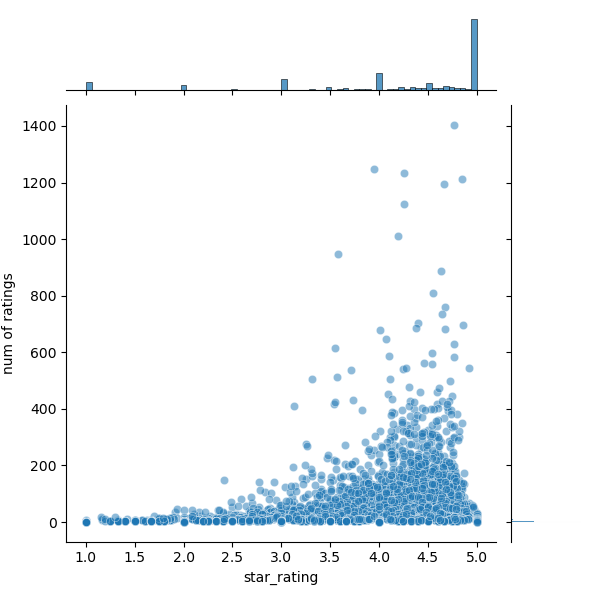

## **Description**

This project focuses on developing a comprehensive recommendation system for baby products, utilizing both ratings and product titles to provide personalized recommendations to users.

## Step 0: Data extraction

- Purpose: Sourced from the huggingface [database](https://huggingface.co/datasets/amazon_us_reviews/viewer/Baby_v1_00/train). Visualize the distribution of the ratings, and check the customers with the most reviews and least reviews.

## Step 1: Text data preprocessing

- Purpose: Clean the extracted data to make it suitable for further analysis.
    - Focus on data in the year of 2015
    - Pre-process product titles, review headlines and review bodies: tokenizing titles, removing stop words, lemmatizing words.
    - Use wordcloud to visualize texts data

 

## Step 2: Text data clustering

- Purpose: Use K-means to categorize all products
    - Use tf-idf to vectorize data
    - Determine the optimal number of clusters using the elbow method.
    - Conduct K-means based on the optional number of clusters
    - Visualize and interpret the clusters
    - 

## Step 3: Build recommendation systems

### 3a: Content-based recommendation

- Purpose: Use information from identified clusters to make recommendations
    - Recommendations for Interacted Users: For users who have interacted with the products, the system identifies the cluster labeling of the products. It recommends highly-rated products within the same cluster if the user rates a product poorly and also suggests highly-rated products from other clusters to encourage diversity.
    - Recommendations for New Users: For users who have not yet interacted with any products, the system recommends highly-rated products from all clusters, ensuring a broad range of recommendations.

### 3b: Memory-based recommendation: Collaborative filtering

- Purpose: Use users' ratings of all products to provide personalized recommendations.
    - Use a Toy Model with four users and three items to provide a clearer comprehension of the recommendation models.
    - Item-based and User-based Filtering: constructs item-based (based on item similarity) and user-based (based on user similarity) filtering methods to recommend products to users based on their preferences.
    - Performance Evaluation: Compare the item-based and user-based filtering methods using root mean squared errors to assess their effectiveness. The results showed that item-based filtering has a better performance than user-based filtering:
        
        Item-based Filtering RMSE: 0.4023702354508488
        
        User-based Filtering RMSE: 0.7796756671369341
        

### 3c: Model-based recommendation

- Purpose: Use SVD to decompose user-item matrix
    - Use root mean squared errors to identify the optional K components
    - Then get recommended products based on the optional K components

